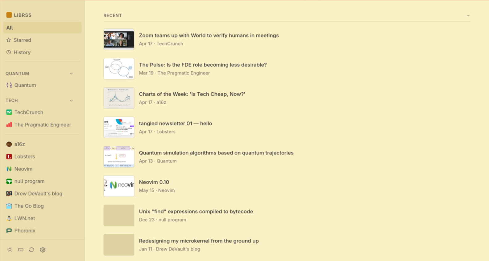

# paperboy

Minimal, opinionated, keyboard-first, local-first RSS reader and podcast player — as your browser's new tab.

No accounts. No cloud sync. No tracking. Your feeds, articles, and episodes live on your machine as plain files.



## What it does

Every new tab opens paperboy. You get your RSS feeds and podcast queue in one place, driven entirely by the keyboard. Articles open in a clean reader. Podcasts play in a persistent bottom bar that survives tab navigation. Everything is stored in `~/paperboy/` as JSON and JSONL — readable, diffable, git-syncable.

## Features

- **RSS 2.0 & Atom** — 15-minute background refresh, categories, starred articles
- **Podcast player** — auto-detects podcast feeds, persistent playback bar, speed control, skip ±15s/30s, state restored on reopen
- **Article reader** — Readability-based extraction, no tracking pixels
- **Keyboard-first** — vim-style navigation throughout, no mouse required
- **Local-first** — all data in `~/paperboy/` as plain JSON/JSONL; git-friendly, no merge conflicts
- **Auto theme** — light (7am–7pm), dark at night; manual override with `t`
- **Pure JS** — no build step, no npm, no transpilation

## Install

```bash
git clone https://github.com/harbefas/paperboy
cd paperboy/cli && bash install.sh
```

The install script creates symlinks in `~/.local/bin/`, installs native messaging manifests for Firefox and Chrome, and sets up `~/paperboy/` as the local storage directory.

### Load the extension

**Firefox:** `about:debugging` → *This Firefox* → *Load Temporary Add-on* → select `manifest.json`

**Chrome:** `chrome://extensions` → enable *Developer mode* → *Load unpacked* → select the repo root

### Initialize storage

```bash
paperboy init    # creates ~/paperboy with a git repo
```

Optionally sync across machines:

```bash
cd ~/paperboy
git remote add origin <your-repo-url>

paperboy sync          # manual sync
*/5 * * * * paperboy sync  # or via cron
```

## Keyboard shortcuts

### Navigation

| Key | Action |
|-----|--------|
| `j` / `k` | Next / previous item |
| `gg` / `G` | First / last item |
| `h` / `l` or `[` / `]` | Previous / next feed |
| `Enter` / `o` | Open article |
| `x` | Open in new tab |
| `Escape` | Back / deselect |
| `Space` / `Shift+Space` | Scroll down / up |

### Actions

| Key | Action |
|-----|--------|
| `s` | Star / unstar |
| `r` | Refresh feeds |
| `t` | Toggle theme |
| `T` | Cycle tag filter |
| `/` | Search |
| `?` | Show all shortcuts |

### Views

| Key | Action |
|-----|--------|
| `A` | All feeds |
| `S` | Starred |
| `H` | History |
| `,` | Settings |

### Podcast player

| Key | Action |
|-----|--------|
| `p` | Play / pause |
| `<` | Back 15s |
| `>` | Forward 30s |

## Storage

Data lives in `~/paperboy/`:

| File | Format | Contents |
|------|--------|---------|
| `feeds.json` | JSON | Subscribed feed URLs |
| `categories.json` | JSON | Feed-to-tag mapping |
| `history.jsonl` | Append-only JSONL | Read article history |
| `starred.jsonl` | Append-only JSONL | Starred articles |

JSONL is intentional — append-only means no merge conflicts when syncing across machines via git.

## Architecture

- **`background.js`** — service worker; fetches and parses feeds, handles caching and background refresh
- **`newtab.js` + `reader.js`** — UI layer; feed list, podcast player, article reader, keyboard shortcuts
- **`cli/paperboy-host.js`** — Node.js native messaging host; reads/writes files in `~/paperboy/`

`storage.js` abstracts dual storage: `browser.storage.local` (primary) with optional native host sync for file-based persistence.

## License

MIT
